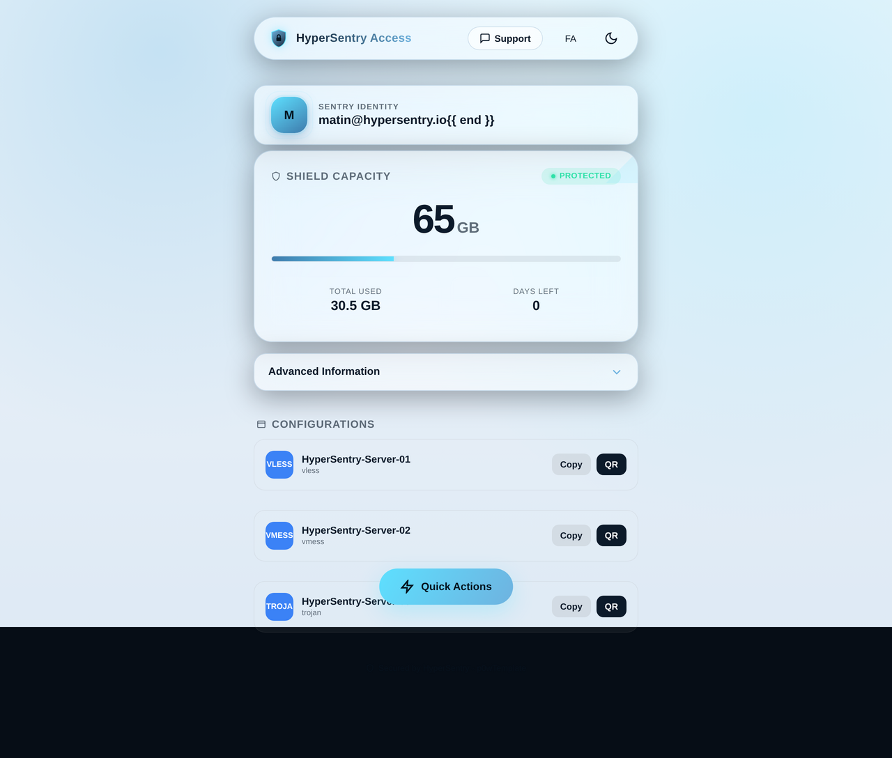
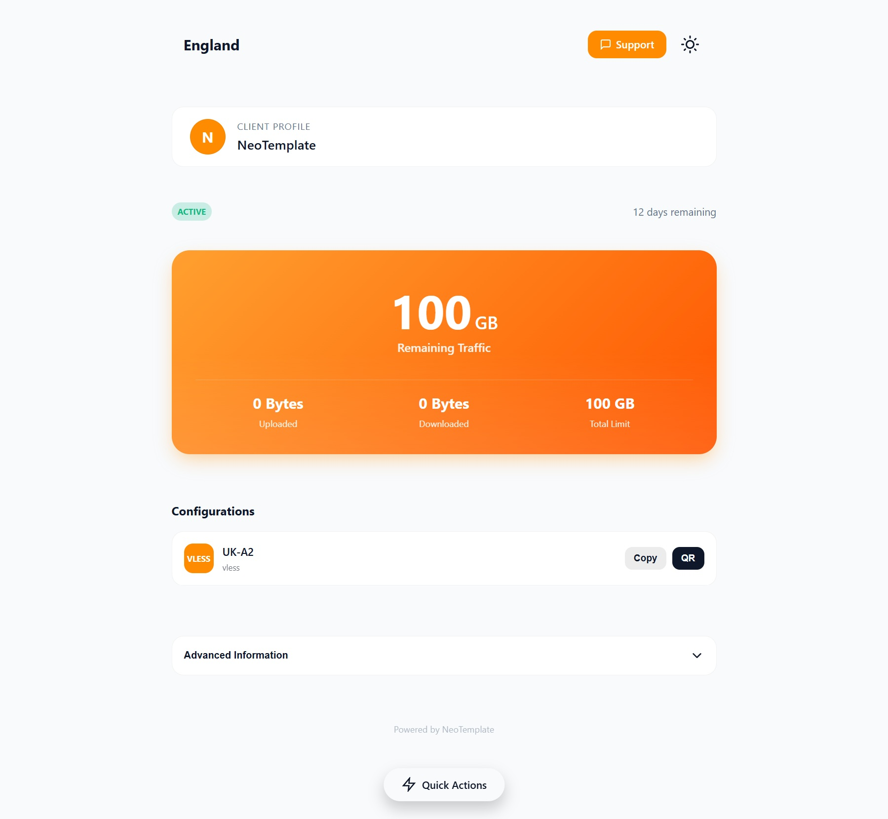
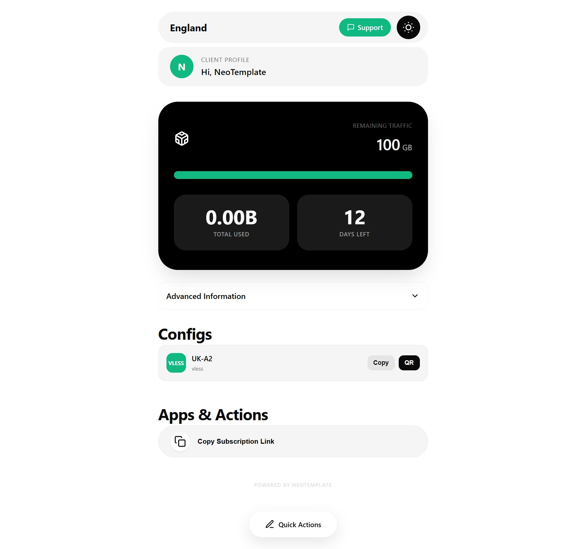
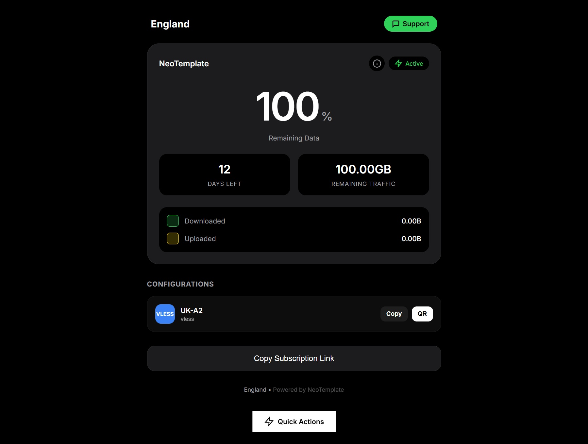
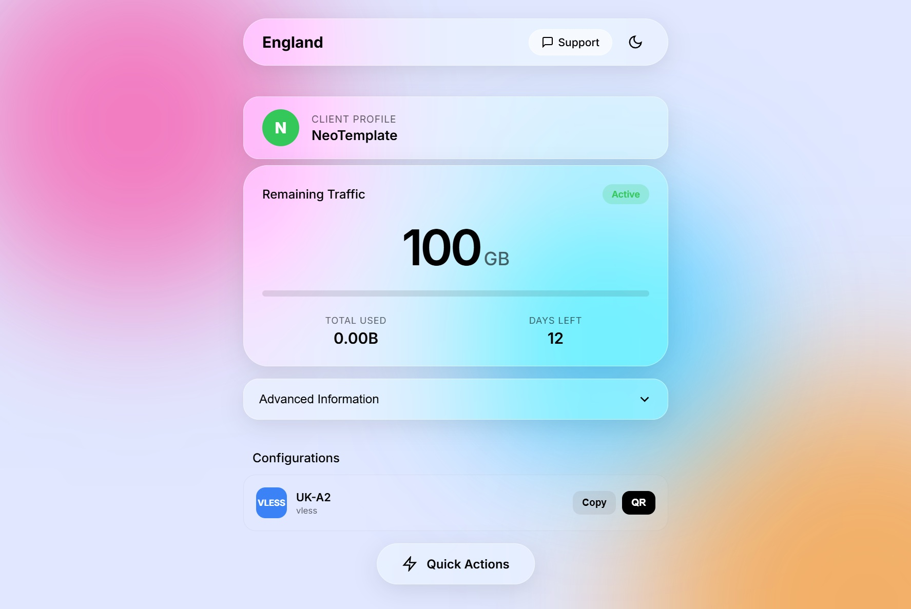

# p0wTemplate

<!-- repo-badges:start -->
<p align="center">
  <a href="https://hits.sh/github.com/power0matin/p0wTemplate/"></a>
  <a href="https://github.com/power0matin/p0wTemplate/stargazers"></a>
  <a href="https://github.com/power0matin/p0wTemplate/forks"></a>
  <a href="https://github.com/power0matin/p0wTemplate/issues"></a>
  <a href="LICENSE"></a>
</p>
<!-- repo-badges:end -->


**p0wTemplate** is a collection of modern, ultra-premium subscription page templates for [3x-ui](https://github.com/MHSanaei/3x-ui) / Sanaei Panel, designed to give your users a polished, professional experience.

> Featuring **HyperSentry** — a signature deep-navy security theme — alongside the full Neo* theme lineup.

[English](#installation) | [فارسی](README_FA.md)


## Features

- 6 premium themes, each with a unique visual identity
- One-click installation via the Theme Manager CLI
- Full light/dark mode support with system preference detection
- Bilingual English/Persian (RTL) with automatic language switching
- Mobile-first responsive design
- QR code generation for config imports
- Quick Actions: copy subscription link, import to V2RayNG / Shadowrocket / v2rayN


## Available Themes

| Theme | Style | Description |
|-------|-------|-------------|
| **HyperSentry** | Signature | Deep-navy glassmorphism with shield branding, animated scan line, and staggered entrance animations |
| **Neo Vibrant** | Bold | Vibrant orange hero card on a deep navy background with pill-shaped config items |
| **Neo Eclipse** | Minimalist | Fintech-inspired with extreme pill shapes and a segmented progress bar |
| **Neo Glass** | iOS/VisionOS | Heavy frosted glassmorphism over colorful gradient blobs |
| **Neo Minimal** | Widget | Ultra-clean widget-style layout inspired by mobile OS battery widgets |
| **Neo Default** | Classic | Clean, modern, and lightweight — the reliable all-rounder |


## Installation

### Quick Install

Copy and paste this into your server terminal:

```bash
bash <(curl -Ls https://raw.githubusercontent.com/power0matin/p0wTemplate/main/theme-manager/install.sh)
```

After installation, run:

```bash
p0wtemplate
```

This opens the Theme Manager menu where you can browse, install, and update themes.

### Apply a Theme

1. Install a theme via the Theme Manager (`p0wtemplate`)
2. Copy the path it provides (e.g., `/etc/3x-ui/sub_templates/hyper-sentry/`)
3. In your 3x-ui panel, go to: **Panel Settings → Subscription → Profile → Sub Theme Directory**
4. Paste the path and save

Your subscription links will now use the new theme.


## Screenshots

<details>
<summary>Click to view theme previews</summary>

### HyperSentry (Signature)


### Neo Vibrant


### Neo Eclipse


### Neo Minimal


### Neo Glass


</details>


## Project Structure

```
p0wTemplate/
├── theme-manager/       # CLI tool for installing and managing themes
├── themes/
│   ├── hyper-sentry/    # Signature theme
│   ├── neo-vibrant/
│   ├── neo-eclipse/
│   ├── neo-glass/
│   ├── neo-minimal/
│   └── neo-default/
└── theme-starter/       # Starter template for creating new themes
```


## Creating a Theme

Use the `theme-starter` directory as a starting point:

1. Copy `theme-starter/` to `themes/your-theme-name/`
2. Edit `manifest.json` with your theme metadata
3. Customize `assets/css/main.css` and `assets/js/app.js`
4. Update `index.html` and `sub.html` with your layout

See the [custom subscription templates docs](theme-manager/docs/custom-subscription-templates.md) for details.


## Support

If you find this project helpful, consider:
- Starring the repo
- Sharing it with others
- Contributing improvements


Maintained by [power0matin](https://github.com/power0matin)
*Built for the 3x-ui community.*
