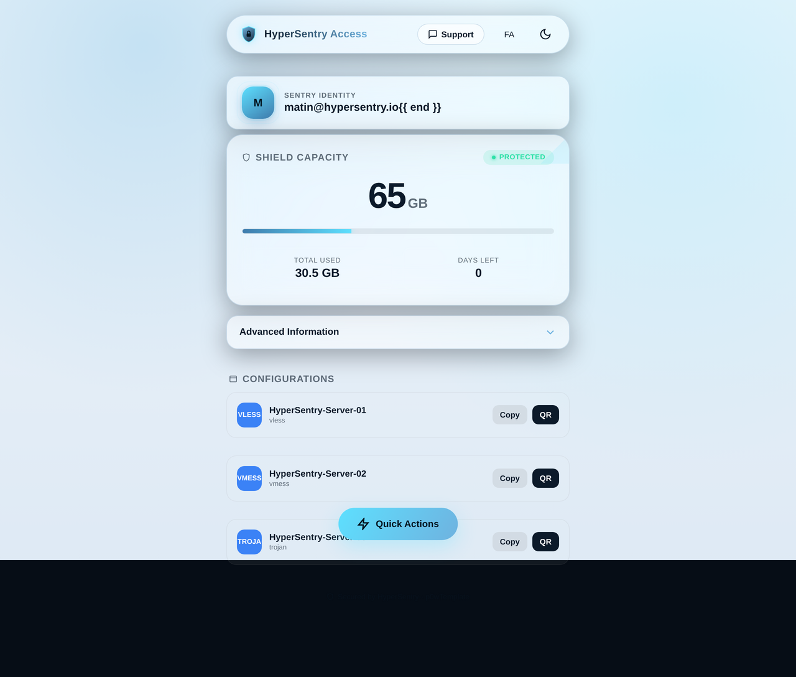
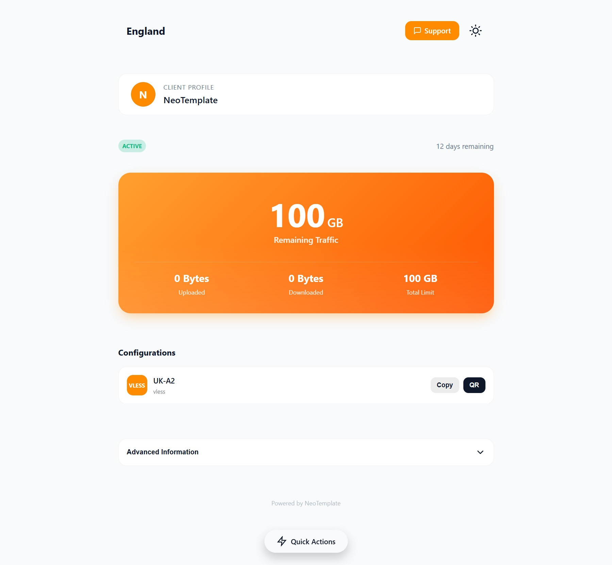
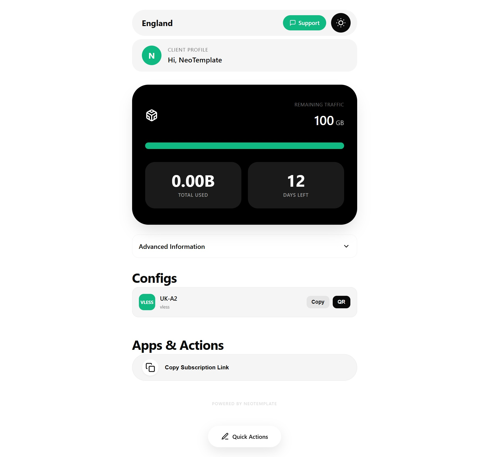
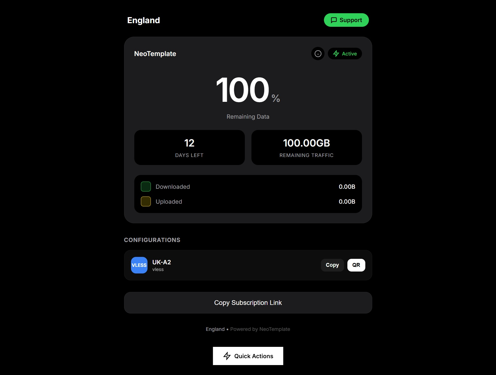
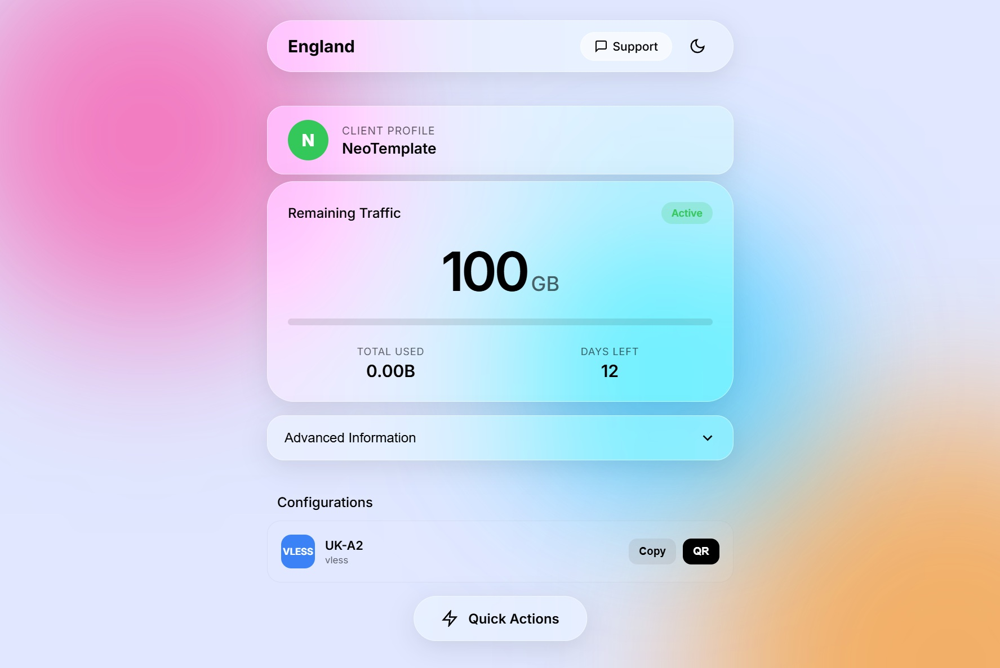

# p0wTemplate


**p0wTemplate** مجموعه‌ای از قالب‌های مدرن و پریمیوم صفحه اشتراک برای پنل [3x-ui](https://github.com/MHSanaei/3x-ui) / ثنایی است که تجربه‌ای حرفه‌ای و زیبا به کاربران شما ارائه می‌دهد.

> شامل تم اختصاصی **HyperSentry** — با طراحی عمقی نیرویی و نشان سپر — به همراه مجموعه کامل تم‌های Neo*

[فارسی](#نصب) | [English](README.md)


## امکانات

- ۶ تم پریمیوم با هویت بصری منحصربفرد
- نصب یک‌کلیکی از طریق ابزار خط فرمان Theme Manager
- پشتیانی کامل از حالت روشن/تاریک با تشخیص تنظیمات سیستم
- زبان دوگانه انگلیسی/فارسی (راست‌چین) با تغییر خودکار زبان
- طراحی واکنش‌گرا موبایل‌محور
- تولید کد QR برای وارد کردن کانفیگ
- عملیات سریع: کپی لینک اشتراک، وارد کردن به V2RayNG / Shadowrocket / v2rayN


## تم‌های موجود

| تم | سبک | توضیحات |
|----|------|---------|
| **HyperSentry** | اختصاصی | شیشه‌ای عمقی نیرویی با برند سپر، خط اسکن متحرک و انیمیشن‌های پلکانی |
| **Neo Vibrant** | جسورانه | کارت قهرمانی نارنجی درخشان با پس‌زمینه نیرویی تیره |
| **Neo Eclipse** | مینیمالیست | الهام‌گرفته از فینتک با طراحی قرصی شدید و نوار پیشرفت تقسیم‌شده |
| **Neo Glass** | iOS/VisionOS | شیشه‌ای مات سنگین روی گرادیان‌های رنگارنگ |
| **Neo Minimal** | ویجت | طراحی تمیز و ساده الهام‌گرفته از ویجت‌های باتری موبایل |
| **Neo Default** | کلاسیک | تمیز، مدرن و سبک — انتخاب قابل اعتماد همه‌کاره |


## نصب

### نصب سریع

دستور زیر را در ترمینال سرور خود کپی و اجرا کنید:

```bash
bash <(curl -Ls https://raw.githubusercontent.com/power0matin/p0wTemplate/main/theme-manager/install.sh)
```

پس از نصب، این دستور را اجرا کنید:

```bash
neotemplate
```

منوی مدیریت قالب‌ها باز می‌شود که می‌توانید قالب‌ها را مرور، نصب و به‌روزرسانی کنید.

### اعمال قالب

۱. یک قالب را از طریق Theme Manager (`neotemplate`) نصب کنید
۲. مسیری که نمایش داده می‌شود را کپی کنید (مثلاً: `/etc/3x-ui/sub_templates/hyper-sentry/`)
۳. در پنل 3x-ui خود به این مسیر بروید: **تنظیمات پنل → اشتراک → پروفایل → مسیر قالب اشتراک**
۴. مسیر را جایگذاری کرده و ذخیره کنید

لینک‌های اشتراک شما اکنون از قالب جدید استفاده می‌کنند.


## پیش‌نمایش تصاویر

<details>
<summary>کلیک کنید برای مشاهده پیش‌نمایش قالب‌ها</summary>

### HyperSentry (اختصاصی)


### Neo Vibrant


### Neo Eclipse


### Neo Minimal


### Neo Glass


</details>


## ساختار پروژه

```
p0wTemplate/
├── theme-manager/       # ابزار خط فرمان برای نصب و مدیریت قالب‌ها
├── themes/
│   ├── hyper-sentry/    # تم اختصاصی
│   ├── neo-vibrant/
│   ├── neo-eclipse/
│   ├── neo-glass/
│   ├── neo-minimal/
│   └── neo-default/
└── theme-starter/       # قالب پایه برای ساخت تم جدید
```


## ساخت قالب جدید

از پوشه `theme-starter` به عنوان نقطه شروع استفاده کنید:

۱. پوشه `theme-starter/` را به `themes/your-theme-name/` کپی کنید
۲. فایل `manifest.json` را با اطلاعات تم خود ویرایش کنید
۳. فایل‌های `assets/css/main.css` و `assets/js/app.js` را سفارشی کنید
۴. فایل‌های `index.html` و `sub.html` را با طرح خود به‌روز کنید


## پشتیبانی

اگر این پروژه برای شما مفید بود:
- ستاره بدهید به ریپازیتوری
- آن را با دیگران به اشتراک بگذارید
- بهبودهایی را پیشنهاد دهید


توسعه‌دهنده: [power0matin](https://github.com/power0matin)
*با ❤️ برای جامعه 3x-ui ساخته شده*
